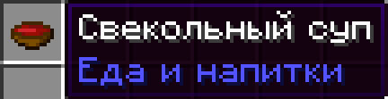
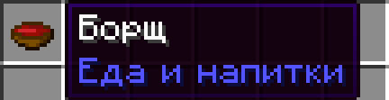

# CustomRussianForMinecraft
  DISCLAIMER: This Resourcepack made only for fun!
This resourcepack adds Ukranian dialect for Russian language. And also has some funny additions.
For example,
It turns this (Свекольный суп):

  
 Into this (Борщ):
 

  
This made because of Russian-speak Ukrainians prefer saying "Borsh" instead of "Beetrootsoup".7
It's also changes "Свёкла" into "Буряк".
